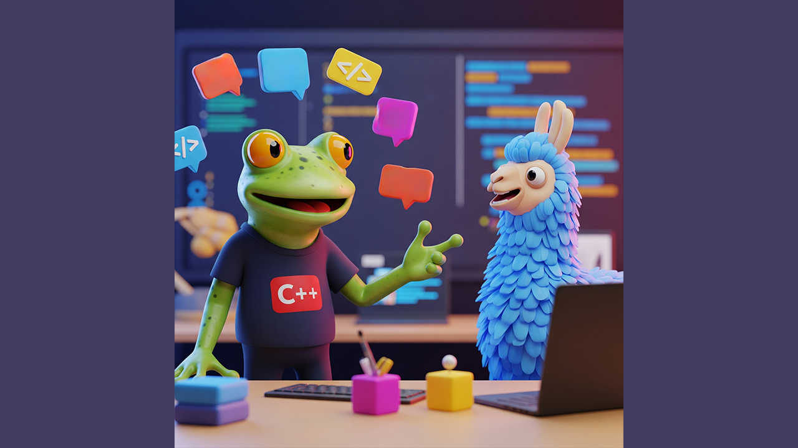

---

# tinyChain (C++ 版本)


---

## 什么是 tinyChain？

**tinyChain** 是一个轻量级框架，旨在帮助您轻松构建**大型语言模型（LLM）驱动的应用程序**。虽然它支持多种语言（C、C++、Java、JavaScript、Python），但此仓库专门针对 **C++ 实现**。

---



## 为什么选择 tinyChain？

我们的目标很简单：为将 AI 能力集成到您现有系统中提供一个**零成本的切入点**。我们相信从小处着手，提供切实的价值，并让您真正了解 LLM 驱动的应用程序是如何从头开始开发的。

### 主要特点：

* **轻量且专注**：我们强调单一 Agent 的能力，使框架保持轻巧且易于管理。
* **无缝集成**：无论您将其视为一个函数还是一个模块，tinyChain 都能以**零成本集成**到您当前的系统中，在您最需要的地方提供智能逻辑单元。
* **多语言支持**：tinyChain 提供 C、C++、Java、JavaScript 和 Python 版本，旨在实现广泛适用性。

---

## tinyChain 适合谁？

* **有编程基础的开发者**：如果您有扎实的编码背景并对 AI 世界充满好奇，tinyChain 是您完美的起点。
* **有志于 AI 开发的开发者**：对于那些希望转型到 AI 应用开发的人员，tinyChain 提供实用、亲身的学习体验。
* **现有 AI 应用开发者**：通过 tinyChain 专注的 Agent 能力和易于集成性，增强您现有项目的功能。

---

## 测试项目
下载项目编译

```
g++ -std=c++17 -o ollama_cpp_client main.cpp Message.cpp LocalOllamaLLM.cpp -lcurl
```

```
./ollama_cpp_client
```

